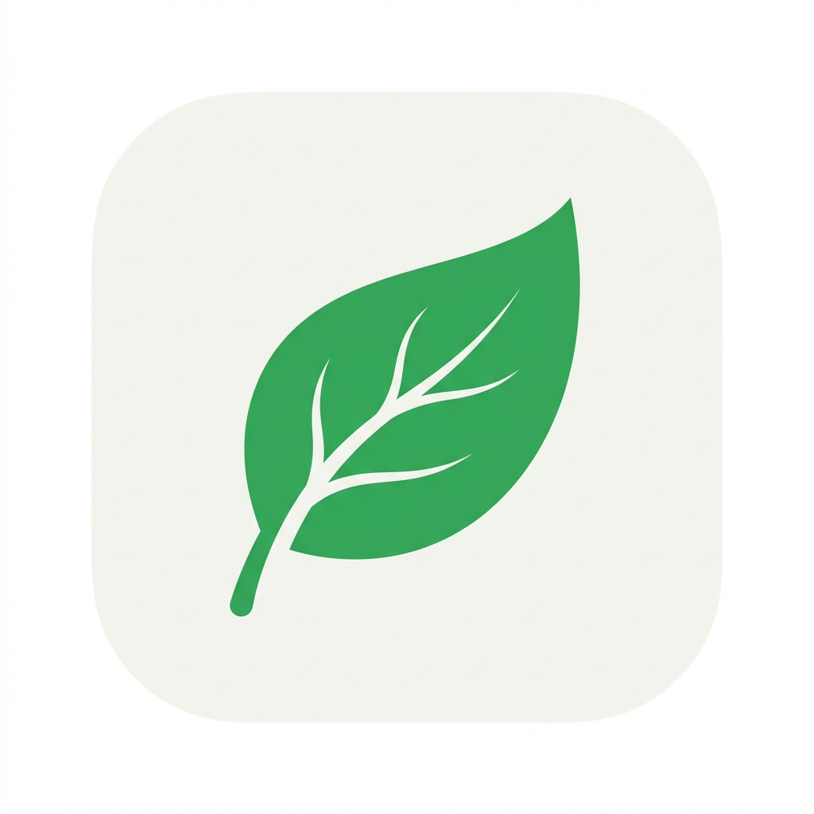

  

# ZenBar 🌱

ZenBar is a highly minimalist and ultra-lightweight macOS menu bar hider. It helps you keep your Mac's menu bar clean and distraction-free by hiding unnecessary icons behind a single, elegant Zen leaf icon.

## 🚀 Features

- **Ultra-Lightweight (Pure AppKit):** Built entirely without heavy UI frameworks (like SwiftUI) to keep the memory footprint incredibly low. ZenBar typically uses around **~8MB of Private Memory**, making it one of the most efficient menu bar managers available.
- **One-Click Toggle:** Click the Zen leaf icon to instantly expand or collapse your hidden menu bar items.
- **Auto-Collapse:** If you expand your icons and don't interact with them, ZenBar will automatically hide them again after 10 seconds.
- **Launch at Login:** Easily configure ZenBar to start automatically when you turn on your Mac.
- **Customizable Layout:** Enter "Edit Mode" to precisely choose which icons should be hidden and which should stay visible.

## 🛠 How to Use

1. **Toggle Visibility:** Left-click or right-click the Zen leaf icon to hide or show your menu bar icons.
2. **Edit Mode:** Right-click the leaf icon and select **"İkonların Yerini Düzenle"** (Edit Mode).
3. **Reordering Icons:** While in Edit Mode, a `/` (separator) icon will appear. Hold down the **`⌘ Command` (CMD)** key and drag the `/` icon left or right.
   - Any app icon placed to the **left** of the separator will be hidden.
   - Any app icon placed to the **right** of the separator will remain visible.
4. **Exit Edit Mode:** Right-click the leaf icon again and select **"Düzenlemeyi Bitir"** (Finish Editing) or simply click the leaf icon.
5. **Launch at Login:** Right-click the leaf icon and toggle **"Başlangıçta Otomatik Açıl"**.

## 💻 Tech Stack

- **Language:** Swift
- **Framework:** AppKit (macOS Native)
- **Minimum OS:** macOS 13.0+

## ⚙️ Installation

1. Clone the repository.
2. Open `ZenBar.xcodeproj` in Xcode.
3. Build and Run.
4. Move `ZenBar.app` from the build folder to your `/Applications` folder.

## ⚖️ License

MIT License
